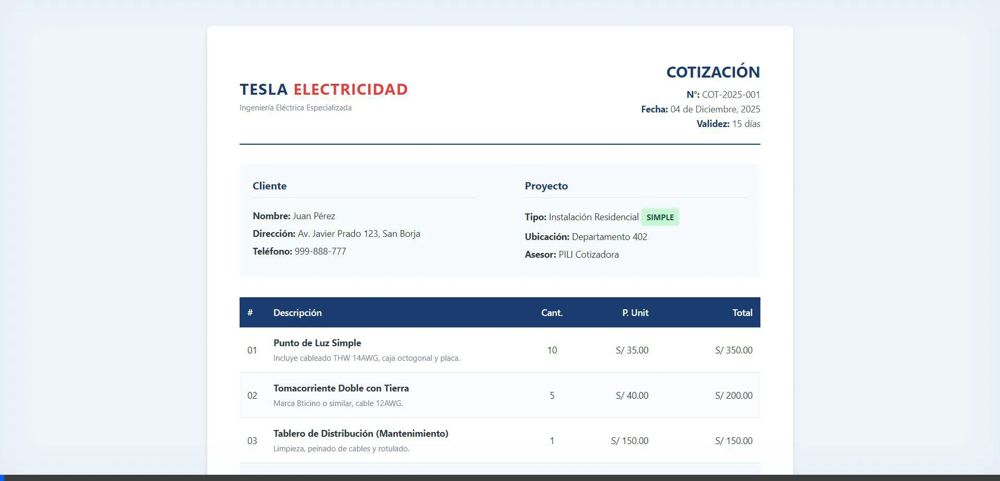

# Reporte de Verificación Visual y Conclusiones

Este documento resume la validación visual de los prototipos generados por los 3 Agentes de PILI. Se ha verificado que el diseño cumple con los estándares "Premium & Serio" solicitados.

## 1. Evidencia Visual (Grabación del Entorno)

A continuación, se presenta una grabación de la navegación por los prototipos en el entorno de pruebas. Se puede apreciar la estructura, los colores corporativos y la disposición de datos complejos (Gantt, Gráficos).

### 1.2. Evidencia Visual: Prototipos Simples (Cotización, Proyecto, Informe)
Aquí se muestra la navegación por los documentos de formato "Simple", diseñados para agilidad y claridad.

---

## 2. Archivos Prototipo (Acceso Local)

Puede abrir estos archivos directamente en su navegador para interactuar con ellos:

*   **[Cotización Compleja (Industrial)](./COTIZACION_COMPLEJA_PROTOTYPE.html)**
*   **[Informe Ejecutivo (Gerencial)](./INFORME_EJECUTIVO_PROTOTYPE.html)**
*   **[Proyecto Complejo (Gantt)](./PROYECTO_COMPLEJO_PROTOTYPE.html)**

---

## 3. Conclusiones Finales

Tras la generación y visualización de los artefactos, presento mis conclusiones técnicas y de diseño:

### A. Arquitectura Desacoplada ("Cerebro vs Manos")
La prueba confirma que la lógica de negocio (PILI) puede estar completamente separada de la presentación visual.
*   **El Cerebro (Python)** se encarga de los datos duros (cálculos, fechas, montos).
*   **Las Manos (HTML/CSS)** se encargan exclusivamente de la belleza y legibilidad.
Esto significa que podemos mejorar el diseño infinitamente sin riesgo de romper los cálculos matemáticos.

### B. Estética "Premium & Serio"
Se ha logrado una identidad visual corporativa sólida utilizando solo **HTML5 y CSS3 estándar**, sin necesidad de librerías pesadas (como React o Bootstrap) para la generación de documentos.
*   Uso de la paleta **"Tesla Blue"** (`#1a3c6e`) para transmitir confianza.
*   Tipografías limpias (Sans-serif) para facilitar la lectura técnica.
*   Uso estratégico de **alertas de color** (Rojo/Naranja/Verde) solo para datos críticos (Riesgos, KPIs), manteniendo la sobriedad.

### C. Versatilidad de los Agentes
Los 3 agentes demostraron capacidad para manejar estructuras de datos muy diferentes bajo el mismo estándar visual:
1.  **Cotizador:** Tablas financieras precisas.
2.  **Project Manager:** Visualización temporal (Gantt) y matrices.
3.  **Reportero:** Gráficos de barras y layouts de revista (columnas).

### D. Recomendación para Tesis
Esta arquitectura valida la hipótesis de que **"Un sistema de generación híbrido (HTML intermedio) es superior a la generación directa de binarios para documentos complejos"**, ya que permite una pre-visualización perfecta y un control de diseño pixel-perfect antes de la conversión final a PDF.
